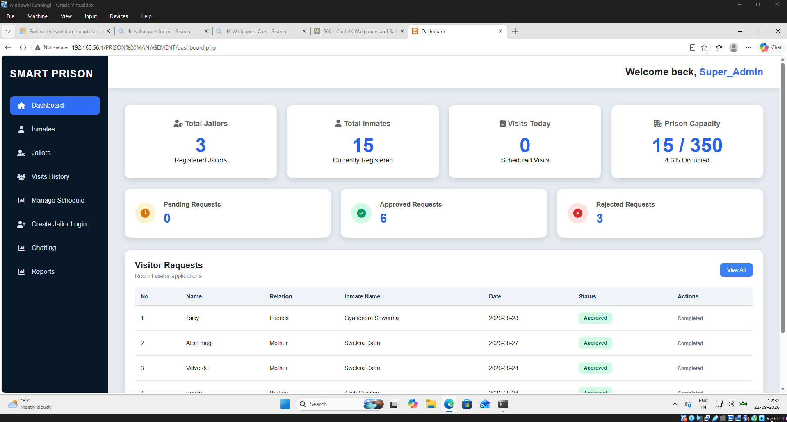

# TITLE: ARP ( Address Resolution Protocol ) Poisoning & MITM ( Man in the middle ) Lab

# Overview:

This project demonstrates an ARP poisoning / Man in the Middle attack in an isolated VirtualBox lab Using kali Linux, Windows
The goal of this Lab is to understand how ARP poisoning works as an attacker how to I place myself between a client and a local
This also demonstrates the vulnerability of using an unencrypted HTTP, that expose submitted form data.

# The Lab Environment:

- Kali Linux
- Windows
- VirtualBox
- Ettercap
- Wireshark
- Apache / XAMPP
- Local Prison Management web application ( One of my project that I stored locally )

# Network Setup:

I created this lab using VirtualBox with two virtual networks adapters on the kali Linux and Windows VMs.

## Host Only Network: 

The ARP poisoning experiment was performed on the isolated host only network "192.168.56.0/24" 
It is the machine that hosts the Web Server of my Prison Management System. 
  -What is it? ==> It is a Role Based Access Web Application, which is part of my project and not secured yet.
Kali Linux and the Windows VM were connected to the same Host only network, it allows them communicate with the Host PC without exposing the experiment to the external network.

Here are the corresponding IPs of all the machines: 
Host PC  192.168.56.1  Local web server 
Kali Linux  192.168.56.101  Attacker 
Windows VM  192.168.56.102  Target 

# How I performed the ARP Poisoning:

## Step 1 (Address Resolved before the Poisoning / working on the target machine)
Opened the terminal on the Windows VM and used the "arp -a" command to view the ARP table and identify the MAC address associated with 192.168.56.1.

## Step 2 ( Working on the attacker machine )
- Opened Kali terminal to confirm our Ip and Mac address.
- Pinged the target machine (192.168.56.102) to check connectivity

### Using Ettercap on Kali to actually perform the actual arp poisoning

- Open Ethercap:
 

- Choosing the right network -> eth1
  

- Scan for all host:
 
 
- List all of the host and assign them:
        . Assign 192.168.56.1 to target 1
        . Assign 192.168.56.102 to target 2
 
- Perform the arp poisoning:
  
- Arp Poisoning Done:
  

## Step 3 ( Going Back to the target machine to check if anything has changed ) 

-Run "arp -a" on Windows VM:
-> The ARP entry for the host machine has changed.
-> The IP address 192.168.56.1 is now associated with the attacker's MAC address.

### Man in the Middle - Now we are successfully placed in the middle of the host machine (  192.168.56.1 ) and  the target machine (  192.168.56.102 )

- In simple words: The target now associates the host's IP address with the attacker's MAC address.

## Step 4 ( intercepting the traffic )

### 1.Open the Prison Management System in a Web Browser from the Windows

-Enter Logging credentials

- Logged in

### 2.Intercepting packets from the attacker's machine 

- Open Wireshark and choose to right network to listen
  

- Seeing all the traffic
- Filter them by using HTTP ( because the Prison Management Web App used HTTP to transfer data )

  
- Now we can clearly see the packet containing the HTTP POST request when the target machine submits the login credentials.
- Right Click on that packet and then -> Follow TCP

### 3. We got the Username and Password

This demonstrates the importance of using HTTPS/TLS to protect sensitive data during transmission.

# Security Lesson

This lab showed how ARP poisoning can allow an attacker to place themselves between a client and a local web server and observe the traffic between them. Since the Prison Management application was using HTTP, the login credentials could be seen in the captured traffic. This demonstrates why sensitive information should be protected using HTTPS/TLS.

